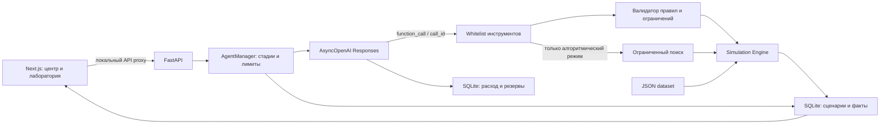

# AI Akim — City Command Center + AI Scenario Lab

Hackathon MVP: соберите пять городских решений вручную или опишите задачу на русском языке, сравните проверенные варианты и сохраните выбранный сценарий. Данные описывают **условную Астану**: это учебная синтетическая модель, а не официальная статистика или прогноз.

## Что работает

- Центр управления: пять районов, десять индикаторов, четырнадцать мер, назначение районов, корзина, бюджет, серверный preview, конфликты и синергии.
- Итоговые расчёты: показатели до/после, критические значения, точное разложение прироста Score, изменение при исключении каждой меры.
- AI-лаборатория: русский запрос → распознанные ограничения → черновики модели → проверка Python → исправления → до трёх различных допустимых вариантов → объяснение.
- Уточнения сохраняют ограничения отдельно от ограниченной истории разговора. Фокус анализа района отличается от запрета назначать меры в других районах.
- Отдельный алгоритмический поиск с ограниченным beam search. Его не запускают автоматически при AI-запросах.
- Сравнение, явное подтверждение замены решений, библиотека сценариев, JSON-экспорт и печатный HTML-отчёт с сохранением в PDF через браузер.
- SQLite: сессии, решения, версии данных, история, операции, кеш, журнал инструментов, токены и оценки расходов переживают перезапуск.
- Статусы, отмена, защита от двойной отправки, лимиты времени/вызовов/стоимости и явные ошибки провайдера.

Ручной режим и алгоритмический поиск не требуют ключа. Для генерации и объяснений через OpenAI нужен ключ backend. Шаблонный fallback **по умолчанию отключён**.

## Локальный запуск

Нужны Python 3.12+ и Node.js 22+. Команды Windows PowerShell выполняются из корня репозитория. Если `.venv` уже существует, повторно создавать её не требуется.

```powershell
python -m venv .venv
.\.venv\Scripts\python.exe -m pip install -r backend/requirements.txt
if (-not (Test-Path .env)) { Copy-Item .env.example .env }
.\.venv\Scripts\python.exe -m uvicorn app.main:app --app-dir backend --host 127.0.0.1 --port 8000
```

При необходимости заполните `OPENAI_API_KEY` в корневом `.env` **до запуска backend**. Существующий `.env` не заменяйте. Backend загружает его автоматически; уже установленные переменные процесса имеют приоритет. Секрет не передаётся браузеру.

Первое использование `tiktoken` может загрузить официальный словарь токенизации; это не платный API-вызов. Docker загружает словарь при сборке. Если он недоступен, применяется консервативная оценка, которая может отклонить большой контекст до обращения к модели.

Во втором терминале:

```powershell
cd frontend
npm.cmd ci
npm.cmd run dev
```

- Интерфейс: <http://localhost:3000>
- Проверка backend: <http://127.0.0.1:8000/health>
- API и схемы: <http://127.0.0.1:8000/docs>

Для macOS/Linux используйте `python3 -m venv .venv`, `.venv/bin/python` вместо Windows-пути и `npm` вместо `npm.cmd`. Активация окружения не обязательна. Для разработки можно добавить `--reload` к uvicorn; перезапуск прерывает текущую AI-операцию.

Next.js проксирует `/api/*` в backend. Другой адрес задаётся через `BACKEND_URL` в `frontend/.env.local` перед запуском/сборкой; после изменения production-сборку повторяют.

### Ошибки Windows

- `npm ci: EPERM unlink …next-swc…node`: остановите **сервер этого проекта** через `Ctrl+C` в его терминале. Он может удерживать нативный модуль Next.js. Затем повторите `npm.cmd ci`. Если файл по-прежнему занят, проверьте синхронизацию OneDrive/антивирус; проект можно держать вне синхронизируемого рабочего стола.
- `WinError 10013`: Windows запретила привязку сокета; возможен зарезервированный диапазон портов. Проверьте `netsh interface ipv4 show excludedportrange protocol=tcp`. Можно запустить backend с `--port 8011` и указать `BACKEND_URL=http://127.0.0.1:8011` в `frontend/.env.local`.
- Занятый порт (`10048`): завершите прежний сервер этого проекта через `Ctrl+C`. Не завершайте все процессы Python/Node на компьютере.
- Используйте `npm.cmd`, если execution policy блокирует `npm.ps1`.

## Docker Compose

Нужен Docker Desktop с Linux containers и современный Docker Compose (поддержка необязательного `env_file`).

```powershell
docker compose config --quiet
docker compose up --build
```

Frontend доступен на localhost:3000, backend — localhost:8000. Порты опубликованы только на loopback. Compose передаёт `.env` только backend. SQLite хранится в named volume `akim_state` по пути `/app/state/akim.sqlite3`; обычные `restart` и `down` данные сохраняют. `docker compose down --volumes` удаляет эту базу — для обычной остановки используйте `docker compose down`.

`.env`, локальные SQLite и `.venv` исключены из Docker build context. Клиент OpenAI всегда использует официальный `https://api.openai.com/v1`: сторонний `OPENAI_BASE_URL` не применяется.

## Архитектура и границы ответственности



LLM интерпретирует запрос через Pydantic Structured Outputs, предлагает **только решения**, вызывает инструменты и объясняет рассчитанные факты. Python проверяет бюджет, назначения, конфликты и пользовательские ограничения, вычисляет Score и выдаёт серверный `scenario_id`. Числа из ответа LLM не становятся метриками интерфейса.

`get_city_context`, `evaluate_scenarios` (пакет до трёх), `compare_scenarios` доступны модели через строгие схемы. `search_scenarios` доступен лишь в явно выбранном алгоритмическом режиме. Обрабатываются все `function_call` и соответствующие `function_call_output`; произвольного выполнения кода, SQL, команд или URL из ответа модели нет.

История хранится в приложении и явно передаётся в Responses, `store=False`; `previous_response_id` не смешивается с ней. Нормализованные условия сохраняются независимо от обрезки истории. Эффективный бюджет: `min(100, max_budget, 100 − reserve_budget)`. Неизвестные меры/районы, неоднозначности и доказанные противоречия требуют уточнения.

При отклонении черновика модель получает рассчитанные Python стоимость, доступный бюджет, превышение, стоимость отдельных мер и число мер по категориям. Следующий раунд исправляет состав по этим данным в прежних лимитах вызовов. Показатели для анализа (например, школы и поликлиники) не обязывают выбирать конкретные мероприятия. Старые отклонённые черновики проверяются заново, чтобы кеш не скрывал актуальную диагностику.

`NO_VERIFIED_CANDIDATES` означает, что модель исчерпала попытки без допустимого результата. Конкретные ошибки проверки и ID операции записываются в терминал backend. Например, при `max_budget=90` и `reserve_budget=30` допустимый расход равен **70**. Условия не ослабляются автоматически; можно повторить AI-генерацию или явно выбрать алгоритмический поиск с теми же ограничениями.

Интерфейс показывает короткий статус и следующий шаг, без внутренних кодов ошибок, ссылок валидатора и трассировок. Это относится также к этапам операции и ранее сохранённой истории. Технические подробности остаются в терминале backend и серверной диагностике; API-ключи и исходные ответы провайдера в лог не попадают. Ошибки соединения frontend дают безопасную диагностическую метку, которую `next dev` выводит в терминал. Подсказки по составлению сценария (число решений, бюджет, несовместимость мер) сохраняются.

Исходники:

- `backend/app/ai/settings.py`, `provider.py`, `usage.py` — конфигурация, единый асинхронный клиент и учёт расходов.
- `backend/app/ai/agent.py`, `contracts.py`, `constraints.py`, `tools.py`, `evidence.py` — оркестрация, схемы, инструменты и ссылки на факты.
- `backend/app/simulation/` и `optimizer/` — детерминированные расчёты и отдельный ограниченный поиск.
- `backend/app/storage.py`, `api/workspace.py` — хранение и сессионные API.
- `frontend/src/components/` — центр, лаборатория, результаты, библиотека и отчёт; `src/lib/use-ai-run.ts` — polling и отмена.

## Достоверность объяснений

Объяснение имеет поля `summary`, `observations`, `remaining_issues`, `tradeoffs`, `limitations`, `evidence_refs`, `scenario_ids`. Backend проверяет ID и ссылки. Числовые утверждения модель формирует как `[fact:reference]`; значения подставляет backend. Неизвестные ссылки и числовые литералы отклоняются. Это обеспечивает проверяемость чисел, но **не доказывает отсутствие смысловых ошибок LLM**.

Ссылки на списки, например `A.critical_after` и `A.activated_synergies`, допустимы как основания качественного объяснения. Их количество — отдельный факт `A.critical_after.count`; список не подменяется числом. При ошибке ссылок или числового формата агент один раз запрашивает исправление объяснения, если `AI_MAX_REPAIR_ROUNDS` положителен и остались разрешённые вызовы. Эта попытка входит в общий бюджет, usage и тайм-аут операции; непроверенный текст не выдаётся и не кешируется.

Поля элементов коллекций доступны по каноническим ссылкам вида `A.critical_after.0.value`. Запись с индексом `[0]` принимается только при точном совпадении с существующим серверным фактом; неизвестные индексы и поля отклоняются.

Карточки всегда используют engine. Сохранённые сценарии проверяются на принадлежность сессии и версию данных; при объяснении/сравнении числовые результаты пересчитываются. Preview и открытие результатов не вызывают LLM. Объяснение запускается отдельной кнопкой.

Метаданные показывают запрошенную/фактическую модель, число попыток API, `used_llm`, fallback, кеш, usage и оценку USD. Кеш помечен «Ранее сформировано моделью; возвращено из кеша». Наличие ключа само по себе не означает успешного использования модели. При ошибке с выключенным fallback объяснение остаётся недоступным; проверенные варианты и ручные расчёты сохраняются.

## Математика

```text
H = 8 кварталов
actual_effect = dataset_effect × (H − lag) / H
I_new[d,k] = clip(I_initial[d,k] + Σ actual_effect[d,k] + synergy[d,k], 0, 100)
D[d] = Σ weights[k] × I_new[d,k]
D_avg = Σ population_share[d] × D[d]
N_crit = count(I_new[d,k] < 40)
Score = 0.7 × D_avg + 0.3 × min(D[d]) − N_crit
ΔScore = 0.7 × ΔD_avg + 0.3 × (min_after − min_before) + N_crit_before − N_crit_after
```

Синергии не масштабируются лагом; отрицательные эффекты сохраняются; clipping выполняется после суммирования. Ровно 40 не критично. Внутренние значения не округляются. Waterfall показывает три **аддитивных** компонента последней формулы.

«Изменение при исключении меры» = `Score(весь сценарий) − Score(без меры)`. Синергии и пороговые эффекты могут пересекаться, поэтому эти leave-one-out значения не складываются в разложение общего прироста.

Radar по направлению использует нормированное среднее: `Σ(weights[k] × indicator[k]) / Σ(weights[k])` по индикаторам направления; шкала 0–100. Это отличается от ненормированного вклада направления в Score.

Preview принимает 0–5 решений; финальный сценарий — ровно пять уникальных мер, не более двух в одном направлении. Бюджет 100. Районные меры требуют существующий район, городские — `district=null`. Конфликт M1/M3 глобальный; M4/M7 и M5/M13 конфликтуют лишь в одном районе. Невалидный сценарий не получает Score.

База: `D_avg=56.8624`, `Score=52.55768`, два критических показателя. Контрольный набор: M7, M8, M10 в Нуре; M12 для города; M5 в Сарыарке. Стоимость 95, Score 56.54307, критических показателей нет, синергия M10+M12 активна. Независимые Decimal-тесты вычисляют эти значения из исходных JSON. Исходных PDF в репозитории нет; пять файлов dataset сохранены без изменения правил.

## Настройки и расходы

Все значения ниже реально применяются backend. Лимиты количества/токенов/времени можно уменьшить; значения выше указанных максимальных границ не принимаются.

| Переменная | По умолчанию |
| --- | --- |
| `AI_ENABLED` | `true` |
| `AI_PROVIDER` | `openai` |
| `OPENAI_API_KEY` | пусто |
| `OPENAI_MODEL` | `gpt-4.1-mini` |
| `AI_ALLOW_TEMPLATE_FALLBACK` | `false` |
| `AI_MAX_MODEL_CALLS_PER_RUN` | `6` |
| `AI_MAX_TOOL_CALLS_PER_RUN` | `8` |
| `AI_MAX_REPAIR_ROUNDS` | `2` |
| `AI_MAX_CANDIDATES` | `3` |
| `AI_MAX_INPUT_TOKENS` | `12000` |
| `AI_MAX_OUTPUT_TOKENS` | `2500` |
| `AI_RUN_TIMEOUT_SECONDS` | `120` |
| `AI_MAX_CONCURRENT_RUNS` | `1` |
| `AI_DAILY_SPEND_LIMIT_USD` | `2` |
| `AI_RUN_ESTIMATED_COST_LIMIT_USD` | `0.10` |
| `ALLOW_LIVE_AI_TESTS` | `false` |
| `DB_PATH` | `var/akim.sqlite3` |
| `AI_PRICING_PATH` | `data/ai_pricing.json` |
| `DATA_DIR` | корневой `data/` |
| `BACKEND_URL` | `http://127.0.0.1:8000` |

Поддержаны `gpt-4.1-mini` и snapshot `gpt-4.1-mini-2025-04-14`. Другая настроенная владельцем модель не подменяется: приложение явно сообщает о неподтверждённой совместимости. Расширение списка требует проверки схем и тарифа.

Тарифы вынесены в `data/ai_pricing.json`: дата проверки 2026-09-23, источник — [официальная страница GPT-4.1 mini](https://developers.openai.com/api/docs/models/gpt-4.1-mini). За миллион токенов: вход $0.40, кешированный вход $0.10, выход $1.60. Это конфигурация оценки, а не гарантия будущей цены.

Перед каждой попыткой резервируется стоимость полного разрешённого входа/выхода; SQLite-транзакция учитывает уже зарезервированные запросы. После ответа учитываются все usage run, включая cached input. При неизвестном usage стоимость остаётся неизвестной, а консервативный резерв сохраняется. При неизвестном тарифе новый платный запрос блокируется. Дневной лимит считается по UTC. Счётчик переживает перезапуск.

У SDK `max_retries=0`; собственная обёртка ограниченно повторяет только временные ошибки. Ошибки ключа, доступа к модели, биллинга/квоты и временного rate limit различаются. Повторные попытки входят в общий лимит. Отмена прекращает дальнейшие итерации, но не обещает отмены уже возникшего расхода у провайдера.

Учёт приложения **не является балансом аккаунта OpenAI**: ключ может использоваться другими программами. При явно включённом fallback выводится пометка «Шаблонное объяснение, без вызова модели»; шаблон не генерирует AI-варианты.

## Проверки

Обычные тесты работают без API-кредитов: mock provider, пустой ключ, отключённый AI и запрет внешнего HTTP transport в pytest.

```powershell
.\.venv\Scripts\python.exe -m pytest backend/tests -q
cd frontend
npm.cmd test
npm.cmd run typecheck
npm.cmd run build
```

Проверяются математика, ограничения, реальные формы function-call/output с моками, исправления, изоляция сессий, сохранение, кеш, отмена, idempotency, error classes и резервирование бюджета. Frontend-тесты проверяют API и пользовательские взаимодействия; они не заменяют просмотр дизайна в настоящем браузере.

После запуска обоих серверов из корня:

```powershell
.\.venv\Scripts\python.exe scripts/smoke.py
```

Этот HTTP smoke проверяет страницу и Next.js proxy, preview/final, поиск, сравнение, сохранение/загрузку/экспорт. Он не вызывает OpenAI. Для другого frontend: `--base-url http://127.0.0.1:3001`.

Отдельная **платная** live-проверка требует явного запуска:

```powershell
.\.venv\Scripts\python.exe scripts/live_smoke.py --execute
```

Она использует настроенный backend-ключ, отдельную сохраняемую БД/квитанцию в `var/`, ограничивает суммарную проверку восемью API-попытками и $0.50, выводит только безопасные метаданные. Повторный запуск учитывает прежние попытки; ключ и raw provider errors не печатаются. `ALLOW_LIVE_AI_TESTS=true` позволяет запуск без `--execute`. Скрипт не входит в pytest или npm test. Фактически выполненные проверки и ограничения среды отражены в [PROGRESS.md](PROGRESS.md).

Для продолжения уточнением в сохранённой сессии предусмотрен `--execute --resume`; он не сбрасывает лимиты. В ходе этой доработки уже использованы все восемь разрешённых попыток, на сумму около **$0.01097**. Реальная генерация, инструменты и сохранение условий при уточнении подтверждены. Успешное live-объяснение **не подтверждено**: первый текст отклонён проверкой ссылок, а после исправления оставшиеся попытки ушли на генерацию. Исправление покрыто офлайн-тестами; лимит ради повторной проверки не обходился.

После этого агент дополнительно научен оставлять последний доступный вызов для объяснения уже проверенных вариантов, даже если их меньше запрошенного числа. Это изменение проверено mock-тестами.

## API

`POST /api/sessions` создаёт сессию. Для сценариев, истории и AI передавайте её токен в `X-Session-ID`. Браузер хранит его в localStorage. Сохранённые сценарии доступны после перезагрузки с тем же токеном; очистка браузерного хранилища создаст новую сессию и не перенесёт старую библиотеку автоматически.

| Метод и путь | Назначение |
| --- | --- |
| `GET /health`, `/api/districts`, `/api/measures`, `/api/base-state` | Доступность и исходные данные |
| `POST /api/scenario/validate`, `/preview`, `/simulate` | Проверка и расчёт решений |
| `POST /api/scenario/compare` | Совместимый числовой compare без автоматического LLM |
| `POST /api/optimizer/search` | Явный ограниченный поиск |
| `GET /api/sessions/current` | Ограничения, история, последние операции |
| `GET /api/ai/config`, `/api/ai/usage` | Безопасные настройки и учёт расходов |
| `POST /api/ai/runs` | Начать `generate`, `explain` или `compare`; уникальный `request_id` |
| `GET /api/ai/runs/{run_id}` | Стадия, проверенные варианты, объяснение, метаданные |
| `POST /api/ai/runs/{run_id}/cancel` | Прекратить дальнейшие итерации |
| `POST /api/scenarios`, `GET /api/scenarios` | Сохранение и библиотека |
| `GET /api/scenarios/{id}`, `POST /api/scenarios/{id}/save` | Загрузка/пометка сохранения |
| `POST /api/scenarios/compare` | Сравнение 2–3 ID текущей сессии |
| `GET /api/scenarios/{id}/export` | JSON с решениями и пересчитанным результатом |

Старый `/api/ai/explain` сохранён как совместимый явный вызов с сессией; он использует те же лимиты и managed provider. Новый UI использует runs/polling.

## Демонстрация

1. Откройте центр управления: базовый Score 52.56, в Нуре школы S1=38 и поликлиники S2=35.
2. Загрузите контрольный набор, рассчитайте итог: бюджет 95, Score 56.54. Посмотрите разложение и показатели до/после.
3. Нажмите «Объяснить с помощью ИИ»; проверьте фактическую модель и расход.
4. В AI-лаборатории: «Покажи три допустимых варианта с бюджетом не больше 90. Не используй M3. Отдельно покажи изменения школ и поликлиник Нуры».
5. Проверьте распознанные условия, стадии и только затем карточки прошедших проверку вариантов.
6. Уточните: «Теперь оставь минимум 20 единиц бюджета. Остальные ограничения сохрани». Эффективный бюджет станет 80; M3 останется исключённой, фокус Нуры сохранится.
7. Выберите варианты для сравнения, запросите объяснение, сохраните сценарий и экспортируйте JSON/отчёт.
8. Нажмите применение, подтвердите замену текущего набора. После перезапуска откройте сценарий из библиотеки.

## Ограничения MVP

Это локальное приложение с изоляцией сессий, проверкой Origin и rate limiting, без публичной системы учётных записей. Не публикуйте расходующие API endpoints наружу без полноценной защиты. Используйте один backend worker: ограничение параллельных запусков находится в процессе; денежные резервы атомарны в SQLite.

AI может вернуть меньше трёх допустимых вариантов или не справиться в установленный лимит. Это не доказательство отсутствия решений. Алгоритмический поиск ограничен ресурсами и не гарантирует глобального оптимума. Зафиксированные меры/разрешённые районы дополнительно фильтруют его ограниченную выборку, поэтому подходящий вариант может остаться вне неё. Модель не объявляет универсально правильное политическое решение; выбор остаётся за пользователем.

Документация OpenAI: [function calling](https://developers.openai.com/api/docs/guides/function-calling), [Structured Outputs](https://developers.openai.com/api/docs/guides/structured-outputs), [Responses](https://developers.openai.com/api/docs/guides/migrate-to-responses).
