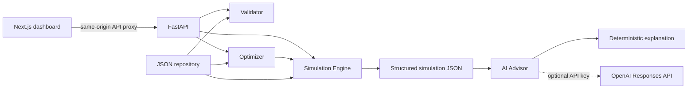

# Akim AI

**Аким на 5 часов — AI City Command Center.** Hackathon MVP: примите пять решений для условной Астаны, проследите изменения качества жизни и сравните альтернативы в Scenario Lab.

Данные и эффекты — **учебная синтетическая модель**, а не официальная статистика или прогноз для реального города. Бюджет измеряется в условных единицах. Приложению не нужен API-ключ или база данных.

## Problem

Городской бюджет приходится распределять между транспортом, экологией, социальной инфраструктурой, безопасностью и ЖКХ. Рост среднего показателя может скрывать отставание района, а эффект дорогой меры проявится лишь через несколько кварталов.

## Solution

- **Command Center:** пять районов, десять индикаторов, radar chart, четырнадцать мер, бюджет и серверный preview при каждом изменении.
- **Пять решений:** ограничения категорий, конфликтов и бюджета; активные синергии и понятные ошибки.
- **Результаты:** до/после, критические показатели, вклад каждой меры через leave-one-out и объяснение результата.
- **Scenario Lab:** поиск альтернатив под приоритет, район, бюджет, резерв и исключения; сравнение и перенос в Command Center.
- **AI Advisor:** объясняет рассчитанные результаты; без ключа или при ошибке API работает детерминированный генератор.

## Architecture



```text
.
├── frontend/
│   ├── src/app/             # Next.js dashboard and styles
│   ├── src/components/     # charts, scenario lab, results, advisor
│   ├── src/lib/            # strict TypeScript API contracts
│   ├── package-lock.json
│   └── Dockerfile
├── backend/
│   ├── app/
│   │   ├── main.py         # HTTP application
│   │   ├── models.py       # Pydantic schemas
│   │   ├── repository.py   # replaceable dataset
│   │   ├── simulation/    # validation, effects, scoring, synergies
│   │   ├── optimizer/     # bounded deterministic search
│   │   └── ai/            # templates and optional OpenAI adapter
│   ├── tests/
│   ├── requirements.txt
│   └── Dockerfile
├── data/
│   ├── districts.json
│   ├── measures.json
│   ├── config.json
│   ├── synergies.json
│   └── incompatibilities.json
├── .env.example
├── scripts/smoke.py         # running full-stack HTTP demo check
└── docker-compose.yml
```

## Deterministic vs AI responsibilities

**Simulation Engine calculates. AI explains.** Python вычисляет бюджет, лаги, эффекты, синергии, ограничения, критические показатели, Score, вклад мер и сценарии. LLM не участвует в оптимизации и не изменяет результаты.

Endpoint объяснения заново вычисляет результат по решениям: присланные клиентом значения Score не используются как источник истины. OpenAI получает JSON с рассчитанными фактами и возвращает Pydantic-структуру. Числа в тексте проверяются по переданным фактам; это дополнительный фильтр, а не доказательство смысловой правильности текста. Ошибка, тайм-аут, отказ или неизвестные числа переключают ответ на шаблон. Поле `source` показывает источник объяснения.

Используются официальный Python SDK и [Structured Outputs через Responses API](https://developers.openai.com/api/docs/guides/structured-outputs). Ключ доступен только backend. Запросы к OpenAI отправляются при объяснении или сравнении и только при наличии ключа.

## Score formula

Горизонт `H = 8` кварталов. Эффект меры умножается на `(H − lag) / H`. Синергии добавляются целиком, затем показатели ограничиваются `[0, 100]`.

```text
I_new[d,k] = clip(I_initial[d,k] + Σ actual_effect[d,k] + synergy[d,k], 0, 100)
D[d]      = Σ weights[k] × I_new[d,k]
D_avg     = Σ population_share[d] × D[d]
N_crit    = count(I_new[d,k] < 40)
Score     = 0.7 × D_avg + 0.3 × min(D[d]) − N_crit
```

Ровно `40` не считается критическим. Внутренние значения не округляются. Базовый Score при отображении — **52.56**, у Нуры два критических показателя: `S1 = 38`, `S2 = 35`.

Вклад меры: `Score(весь сценарий) − Score(без меры)`. Он включает синергии и нелинейный штраф критичности. Сумма вкладов не обязана совпадать с приростом Score. Preview допускает `0–5` решений, итоговый сценарий требует ровно `5`. Остальные ограничения одинаковы. Невалидный сценарий **не получает Score**.

## Dataset

Данные отделены от расчётов. В `config.json` задаются веса, горизонт, лимиты, критический порог и направления. Районы: Есиль, Алматы, Сарыарка, Байконур и Нура. Районная мера действует в указанном районе, городская — во всех пяти.

Синергии: `M1 + M2 → T1 +2`, `M10 + M12 → B1 +2`, `M5 + M6 → E2 +2` в районе соответствующей районной меры. `M1/M3` конфликтуют глобально; `M4/M7` и `M5/M13` — при назначении в один район. Каждая мера уникальна; не более двух мер одной категории; общий бюджет не выше `100`.

## Running locally

Нужны **Python 3.12+** и **Node.js 22+**. Из корня проекта, в двух терминалах:

Backend, Windows PowerShell (активация venv не требуется):

```powershell
python -m venv .venv
.\.venv\Scripts\python.exe -m pip install -r backend/requirements.txt
.\.venv\Scripts\python.exe -m uvicorn app.main:app --app-dir backend --reload --port 8000
```

Backend, macOS/Linux:

```bash
python3 -m venv .venv
.venv/bin/python -m pip install -r backend/requirements.txt
.venv/bin/python -m uvicorn app.main:app --app-dir backend --reload --port 8000
```

Frontend, второй терминал:

```bash
cd frontend
npm ci
npm run dev
```

В PowerShell с ограниченной execution policy используйте `npm.cmd ci` и `npm.cmd run dev`.

- Приложение: <http://localhost:3000>
- Backend: <http://localhost:8000/health>
- Swagger: <http://localhost:8000/docs>

Next.js проксирует `/api/*` на `http://127.0.0.1:8000`. Для другого адреса задайте `BACKEND_URL` в `frontend/.env.local` **перед запуском или сборкой**. При изменении адреса production-сборку нужно повторить.

### Troubleshooting Windows

- `npm ci` сообщает `EPERM: operation not permitted, unlink` для `@next/swc-win32-x64-msvc/*.node`: работающий Next.js удерживает нативный файл SWC. Остановите сервер этого проекта (`npm run dev` или `npm run start`) через `Ctrl+C` в его терминале, затем повторите `npm.cmd ci`.
- Backend сообщает, что порт `8000` уже занят: остановите ранее запущенный backend этого проекта через `Ctrl+C` в его терминале, затем повторите запуск uvicorn.

## Running Docker

Запустите Docker Desktop с Linux containers:

```bash
docker compose up --build
```

Frontend работает на `3000`, backend и Swagger — на `8000`. Backend использует Python 3.12, frontend — Node.js 22. Остановка: `docker compose down`.

Ключ не требуется. Для OpenAI скопируйте `.env.example` в `.env`, заполните ключ и повторно запустите compose. `.env` исключён из Git и Docker build context.

## Running tests

```powershell
.\.venv\Scripts\python.exe -m pytest backend/tests -q
cd frontend
npm.cmd test
npm.cmd run typecheck
npm.cmd run build
```

На macOS/Linux замените путь Python на `.venv/bin/python`, `npm.cmd` на `npm`. Тесты проверяют baseline, лаги, scope мер, синергии, конфликты, лимиты, порог, clipping, независимость от порядка, пример из задания, contribution, optimizer, API и fallback. Реальный ключ для тестов не используется.

После запуска обоих сервисов можно проверить полный demo-flow через Next.js-прокси:

```powershell
.\.venv\Scripts\python.exe scripts/smoke.py
```

Скрипт проверяет HTTP-страницу, dataset, частичный и итоговый расчёты, конфликты, advisor, три альтернативы и сравнение. Это HTTP-интеграционная проверка; она не заменяет визуальную проверку интерфейса в браузере.

## API

| Method | Path | Назначение |
| --- | --- | --- |
| GET | `/health` | Проверка доступности |
| GET | `/api/districts` | Районы с исходными показателями |
| GET | `/api/measures` | Каталог мер |
| GET | `/api/base-state` | Исходный результат симуляции |
| POST | `/api/scenario/validate` | Проверка итогового сценария |
| POST | `/api/scenario/preview` | Расчёт 0–5 решений |
| POST | `/api/scenario/simulate` | Итоговый расчёт 5 решений |
| POST | `/api/scenario/compare` | Два расчёта, сравнение и объяснение |
| POST | `/api/optimizer/search` | Поиск 3–5 альтернатив, если ограничения допускают |
| POST | `/api/ai/explain` | Объяснение simulation result |

Пример `/api/scenario/simulate`:

```json
{
  "decisions": [
    {"measure_id": "M7", "district": "Нура"},
    {"measure_id": "M8", "district": "Нура"},
    {"measure_id": "M10", "district": "Нура"},
    {"measure_id": "M12"},
    {"measure_id": "M5", "district": "Сарыарка"}
  ]
}
```

Бюджет `95`, точный Score `56.54307` (в интерфейсе **56.54**), синергия `M10 + M12` активна. Для compare: `{"scenario_a": {"decisions": [...]}, "scenario_b": {"decisions": [...]}}`. Для AI endpoint передайте полученный simulation result.

`/validate` возвращает `200` с `valid` и `errors`. Невалидные simulate/preview/compare возвращают `422`: `{"valid": false, "errors": [{"code": "...", "message": "..."}]}`. Неправильная форма запроса тоже даёт структурированную ошибку `422` без traceback.

## Scenario Lab

```json
{
  "focus_district": "Нура",
  "max_budget": 90,
  "reserve_budget": 10,
  "exclude_measures": ["M3"],
  "priority": "weakest_district",
  "limit": 4
}
```

Эффективный лимит: `min(max_budget, 100 − reserve_budget)`; резерв не вычитается повторно из уже уменьшенного max_budget. Фокус района — дополнительный критерий при равенстве основных целей.

| Приоритет | Критерий |
| --- | --- |
| overall_score | Максимизировать Score |
| weakest_district | Сначала минимальный районный Score, затем общий Score |
| reduce_critical | Сначала меньше критических показателей, затем Score |
| transport/ecology/social/safety/services | Популяционно взвешенный средний прирост индикаторов направления, затем Score |
| balanced | `Score + 0.2 × weakest − 0.5 × N_crit + 0.1 × Σ min(max(category_delta, 0), 1)` |

Balanced — прозрачный preset, а не математически «лучшее» распределение. Поиск перебирает комбинации пяти уникальных мер с отсечением бюджета, категорий и конфликтов. Назначения по районам рассматриваются ограниченным beam search с детерминированным лимитом кандидатов. Все допустимые наборы мер получают долю этого лимита; финалисты проходят тот же simulation engine, что ручной сценарий.

Ответ содержит число оценок, время, эффективный бюджет и `truncated`. При отсечении поиск не гарантирует глобальный оптимум. Невозможные ограничения возвращают пустой список с пояснением.

## Environment variables

| Переменная | Default | Назначение |
| --- | --- | --- |
| `OPENAI_API_KEY` | пусто | Необязательный ключ, только backend |
| `OPENAI_MODEL` | `gpt-4.1-mini` | Модель с Structured Outputs |
| `BACKEND_URL` | `http://127.0.0.1:8000` | FastAPI для Next.js; применяется при сборке |
| `DATA_DIR` | корневой `data/` | Каталог dataset |

Локально установите переменные backend в окружении или добавьте `--env-file .env` к uvicorn. Docker Compose читает корневой `.env` автоматически. Для fallback оставьте ключ пустым.

## Demo flow

1. Откройте Command Center: базовый Score `52.56` и пять районов.
2. Выберите Нуру, посмотрите `S1` и `S2` ниже порога.
3. Добавьте `M7` в Нуру: бюджет и preview изменятся после ответа backend.
4. Добавьте `M8`, `M10` в Нуру, затем городскую `M12`: появится синергия.
5. Добавьте `M5` в Сарыарку. Этот набор также загружается кнопкой демо-сценария.
6. Рассчитайте итог, изучите before/after, contribution и объяснение.
7. В Scenario Lab задайте Нуру, weakest district и резерв `10`.
8. Сгенерируйте альтернативы, выберите две для Compare, изучите графики и trade-offs.
9. Перенесите альтернативу в Command Center и измените одно решение.

Сценарии хранятся в состоянии браузерной сессии; перезагрузка страницы начинает новый эксперимент. MVP не использует авторизацию, реальные государственные API или постоянную базу данных.
